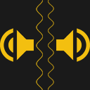

# LRWave
__A web browser becomes a 2-channel function generator__

Available at: https://roger-random.github.io/lrwave/

## Requirements

This web app uses the [W3C Web Audio API](https://www.w3.org/TR/webaudio/)
to generate waveforms sent to left and right audio output channels. Since it is
using API and hardware designed for audio, it can only generate waveforms in the
human audible range. No 2MHz signal here!

If a web browser fails to produce waveforms with this app, check to see if
that browser has web audio API support on
[caniuse.com](https://www.caniuse.com/#search=web%20audio).

## Development

This web app was built using Google's
[Material Design Components for Web](https://material.io/develop/web/) and
closely follows the pattern used by MDC Web's
[Getting Started](https://material.io/develop/web/docs/getting-started/)
sample app, including the use of [Node.js](https://nodejs.org) and tools such as
[webpack](https://webpack.js.org/).

* __Setup__: Install a recent version of [Node.js](https://nodejs.org). Clone
this repository, and run `npm install`
* __Test__: Run `npm start` to launch this app in a development web server. It
will monitor changes and automatically rebuild upon change.
  * Configure listen port with `export PORT=8080` (or replace `8080` with port of your choice.)
  * Configure listen IP with `export IP=0.0.0.0` (or replace `0.0.0.0` with IP address of your choice.)
* __Publish__: Run `npm run build` to generate bundled JavaScript and CSS files
fit for publishing.
* __Release__: Copy updated `index.html` and built files `bundle.css` and
`bundle.js` into `\docs\` and publish all files in that subdirectory.

## History

* 2018/12: Version 1.0

## Updates

See [development blog](https://newscrewdriver.com/category/projects/lrwave/).
